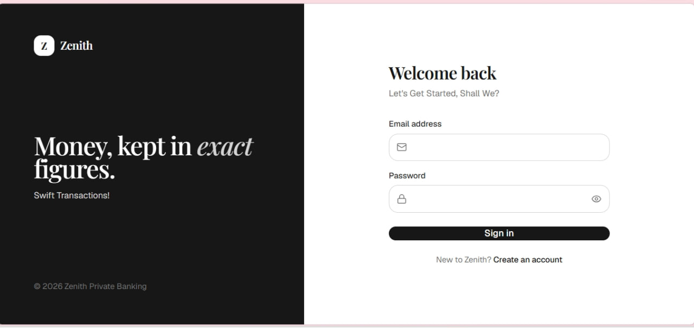
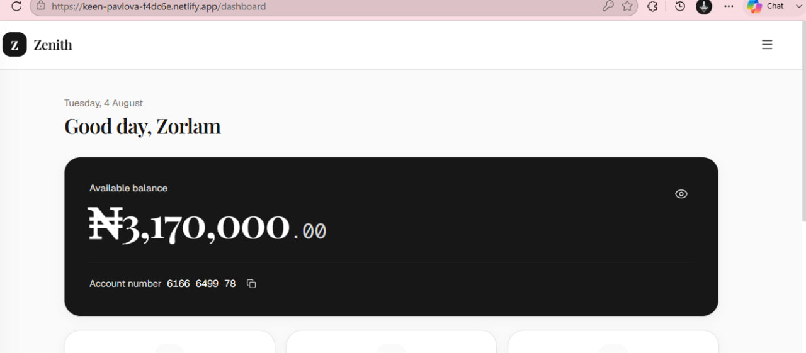
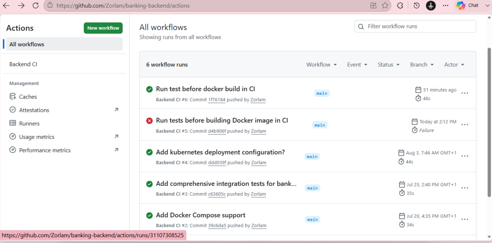
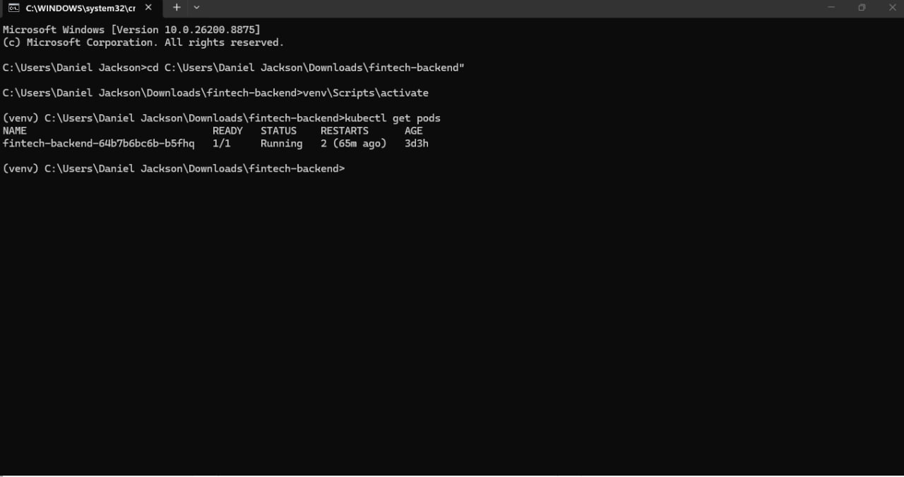
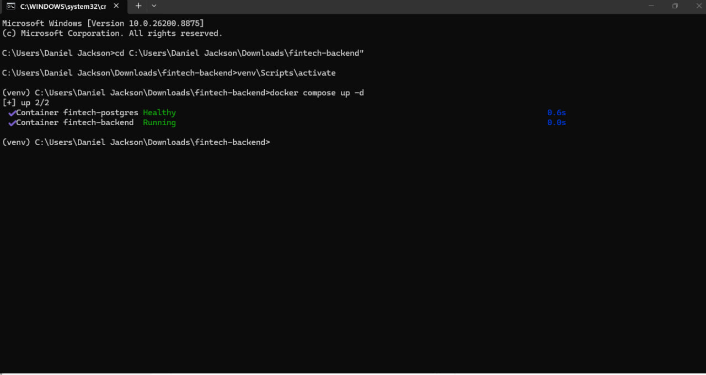

# Zenith 

A production-deployed Flask REST API powering a banking-style fintech application. The backend implements JWT-based authentication, account management, transaction processing, and secure money transfers using PostgreSQL in production.

The project is fully containerized with Docker, supports multi-container local development using Docker Compose, includes automated testing with pytest, Continuous Integration using GitHub Actions, and Kubernetes deployment manifests for local orchestration.

---

## Live Deployment

* **Backend API:** https://banking-backend-2mwq.onrender.com
* **Frontend:** https://keen-pavlova-f4dc6e.netlify.app
* **Production Database:** Neon PostgreSQL

---

## Screenshots

### Login



### Dashboard



### Transaction History


### GitHub Actions CI



### Kubernetes Pods



### Docker Compose



---

## Tech Stack

* Python
* Flask
* Flask-SQLAlchemy
* PostgreSQL (Neon)
* SQLite
* Docker
* Docker Compose
* Kubernetes
* GitHub Actions
* pytest
* Flask-JWT-Extended
* Flask-CORS
* Flask-Talisman
* Gunicorn
* bcrypt

---

## Features

* Containerized Flask backend using Docker.
* Multi-container development environment with Docker Compose (Flask API + PostgreSQL).
* One-command local startup using Docker Compose.
* Kubernetes deployment using Deployment, Service, and Secret manifests.
* Automated testing with pytest.
* Continuous Integration using GitHub Actions.
* JWT authentication using access and refresh tokens.
* Secure password hashing with bcrypt.
* PostgreSQL support for production deployments.
* SQLite support for lightweight local development and automated testing.
* Atomic money transfers using database transactions.
* Server-side validation for all user input.
* Transaction ledger with running balances.
* Money stored as integer minor units (kobo) to eliminate floating-point precision errors.
* Automatic database initialization and demo data seeding.
* CORS configuration for a separate frontend.
* Rate limiting on authentication endpoints.
* Security headers using Flask-Talisman.
* HTTPS enforcement in production.
* Request size limits to reduce abuse.

---

## Running with Docker Compose

Run the backend together with a local PostgreSQL database.

### Prerequisites

* Docker Desktop

### Start the application

```bash
docker compose up --build
```

The command builds the backend image, starts both the Flask API and PostgreSQL containers, waits for the database to become healthy, and launches the application.

The API will be available at:

```
http://localhost:5050
```

### Stop the application

```bash
docker compose down
```

To remove the containers and PostgreSQL data volume:

```bash
docker compose down -v
```

---

## Local Setup (Without Docker)

```bash
python -m venv venv

# Windows
venv\Scripts\activate

# macOS/Linux
source venv/bin/activate

pip install -r requirements.txt

cp .env.example .env

# Configure the required environment variables

python run.py
```

The development server runs on:

```
http://127.0.0.1:5050
```

In production, the application is served with Gunicorn.

---

## Continuous Integration

The project uses GitHub Actions to validate every push and pull request.

Pipeline:

1. Checkout repository
2. Install dependencies
3. Run the complete automated test suite
4. Build the Docker image

The Docker image is only built if all tests pass.

---

## Automated Testing

Run the test suite locally:

```bash
pytest
```

The project currently includes **29 automated tests** covering:

* Authentication
* Account management
* Deposits
* Withdrawals
* Transfers
* Airtime purchases

Tests run against an isolated in-memory SQLite database for fast execution.

---

## Kubernetes

The repository includes Kubernetes manifests for local deployment using Kind.

```
k8s/
├── deployment.yaml
├── service.yaml
└── secret.yaml
```

Resources included:

* Deployment
* Service
* Secret

The application is configured with Kubernetes readiness and liveness probes.

---

## Environment Variables

Required variables:

```
SECRET_KEY=
JWT_SECRET_KEY=
DATABASE_URL=
JWT_ACCESS_TOKEN_EXPIRES_MINUTES=
JWT_REFRESH_TOKEN_EXPIRES_DAYS=
FRONTEND_ORIGIN=
```

See `.env.example` for the complete template.

---

## API

All endpoints are available under `/api`.

| Method | Endpoint                    | Authentication | Description                            |
| ------ | --------------------------- | -------------- | -------------------------------------- |
| POST   | `/auth/register`            | No             | Register a new user                    |
| POST   | `/auth/login`               | No             | Authenticate a user                    |
| POST   | `/auth/refresh`             | Refresh Token  | Generate a new access token            |
| GET    | `/auth/me`                  | Access Token   | Retrieve authenticated user            |
| GET    | `/accounts/me`              | Access Token   | Retrieve account details               |
| POST   | `/accounts/change-password` | Access Token   | Change account password                |
| GET    | `/transactions/history`     | Access Token   | Retrieve paginated transaction history |
| POST   | `/transactions/deposit`     | Access Token   | Deposit funds                          |
| POST   | `/transactions/withdraw`    | Access Token   | Withdraw funds                         |
| POST   | `/transactions/transfer`    | Access Token   | Transfer funds                         |
| POST   | `/transactions/airtime`     | Access Token   | Purchase airtime                       |

All responses are returned as JSON.

---

## Security

Current security measures include:

* bcrypt password hashing
* JWT-based authentication
* Rate limiting on login, registration, refresh, and password change endpoints
* HTTPS enforcement in production
* Security headers (Content Security Policy, X-Frame-Options, Referrer Policy, X-Content-Type-Options)
* Maximum request size limits
* Environment-based secrets
* Comprehensive server-side validation

---

## Architecture

The project follows Flask's application factory pattern, separating routing, models, extensions, validation, and error handling into modular components.

```
app/
├── routes/
│   ├── auth.py
│   ├── accounts.py
│   └── transactions.py
├── models.py
├── validation.py
├── errors.py
├── extensions.py
├── seed.py
└── __init__.py
```

High-level architecture:

```
                 Next.js Frontend
                        │
                  HTTP / JSON
                        │
                        ▼
               Flask + Gunicorn API
                        │
                  SQLAlchemy ORM
                        │
                        ▼
              PostgreSQL Database

Development

Docker Compose
├── Flask Backend
└── PostgreSQL

Continuous Integration

GitHub Actions
        │
        ▼
Install Dependencies
        │
        ▼
Run pytest (29 tests)
        │
        ▼
Build Docker Image

Kubernetes

Deployment
    │
    ▼
Pod
    │
    ▼
Service
```

---

## Known Limitations

This project is intended as a portfolio and learning project.

Current limitations include:

* No email verification
* No refresh token rotation or token revocation
* No idempotency keys for transaction requests
* No KYC or fraud detection
* No regulatory compliance features
* No database migration system (Alembic / Flask-Migrate)

---

## License

This project is provided for educational and portfolio purposes.
